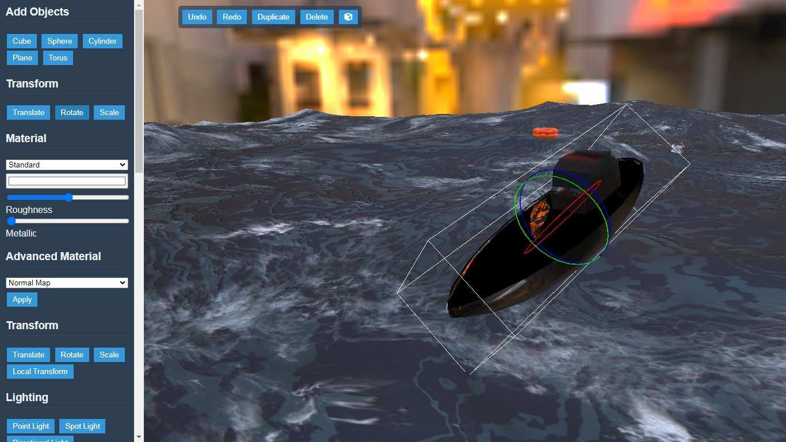
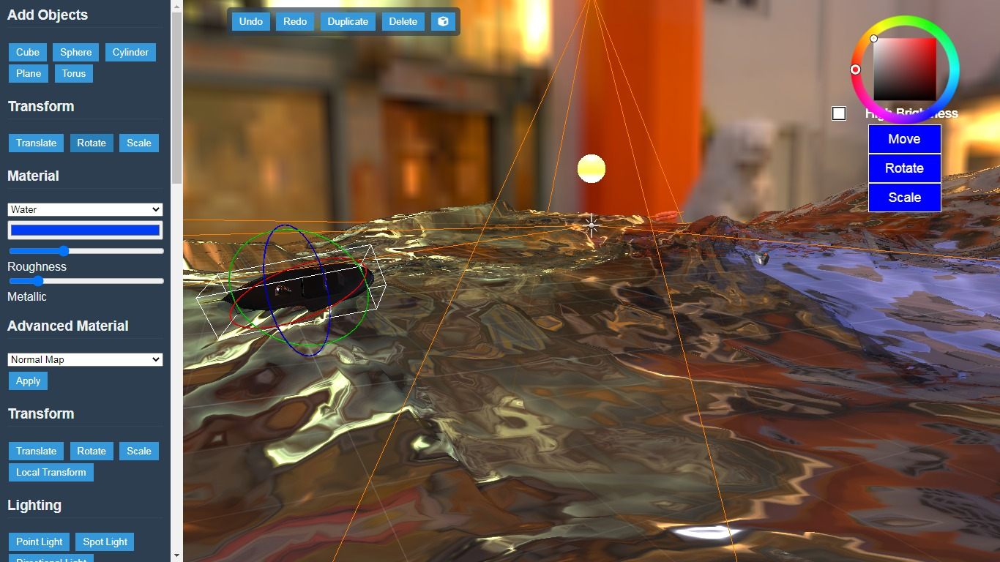
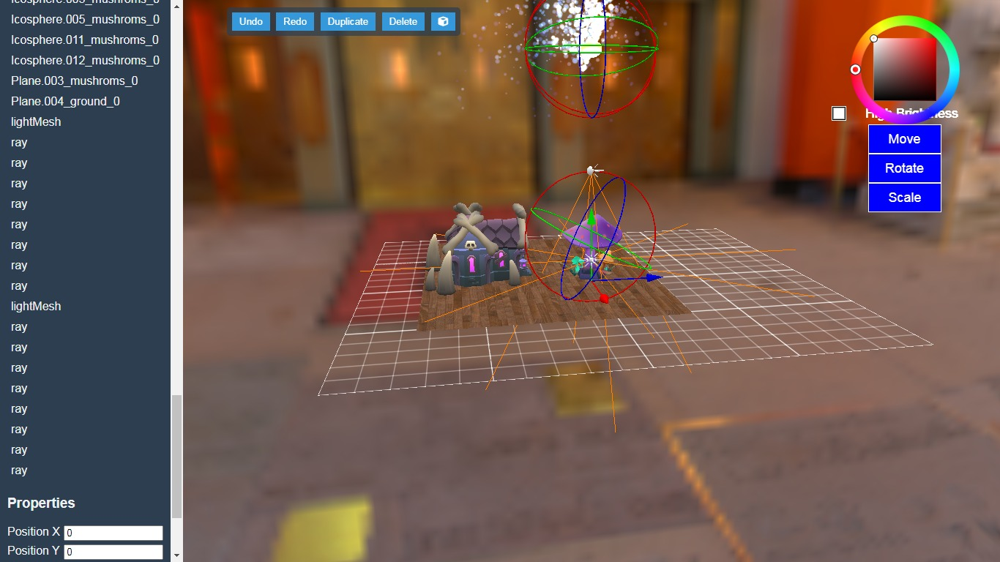

# 3D Modeling Editor

A web-based 3D modeling editor built with *Babylon.js, **HTML, **CSS, and **JavaScript*. This tool allows users to create, manipulate, and refine 3D objects, making it ideal for both beginners and advanced users in 3D design.





## Features

- *Shape Creation*: Add various 3D shapes like cubes, spheres, cylinders, planes, and tori.
- *Transformation Tools*: Move, rotate, and scale objects with intuitive controls.
- *Material Customization*: Adjust materials with roughness, metallic properties, and advanced effects like normal maps.
- *Color Picker*: Precise color selection for objects and backgrounds.
- *Lighting Options*: Add and control point and spot lights to enhance scene realism.
- *Undo & Redo*: Easily correct mistakes or retrace steps during modeling.
- *Real-time Updates*: Changes are reflected instantly in the scene view.

## Getting Started

To get started with the 3D Modeling Editor locally:

1. *Clone the repository*:
   ```bash
   git clone https://github.com/MEDELBOU3/3d_editore.git
   cd 3d-modeling-editor

2. Open the index.html file in your preferred browser.

No additional setup is required since this is a web-based application that runs entirely in the browser.


Usage

1. Adding Objects: Select a shape from the "Add Objects" panel to insert it into the scene.


2. Transforming Objects: Use the "Translate," "Rotate," and "Scale" buttons to modify objects.


3. Applying Materials: Select materials and adjust their properties to customize object appearance.


4. Lighting Setup: Add point or spot lights to control the scene’s lighting.


Advanced Tools

For advanced users, this editor also includes:

Object Smoothing & Sculpting: Tools for refining and sculpting 3D shapes.

HDRI Support: Import HDRI for realistic environmental lighting.

GLB File Import: Import .glb files to work with external 3D models.


Screenshots

Main Interface


Material Customization


Lighting and Transformation


Contributing

Contributions are welcome! Please fork the repository and create a pull request for any improvements or additional features.

1. Fork the repository.


2. Create a feature branch:

git checkout -b feature-new-feature


3. Commit your changes:

git commit -m "Add new feature"


4. Push to the branch:

git push origin feature-new-feature


5. Open a pull request.


License

This project is licensed under the MIT License.

Contact

For questions or support, feel free to reach out via GitHub Issues.
